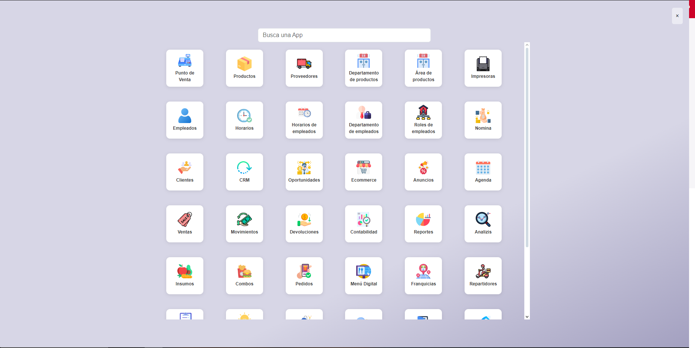
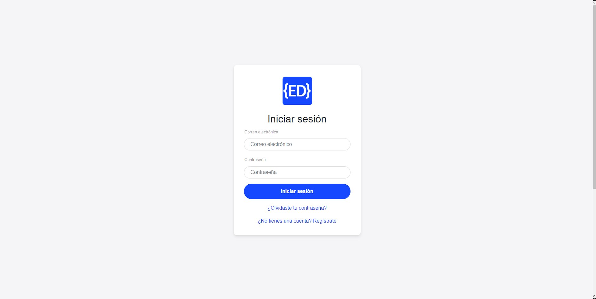
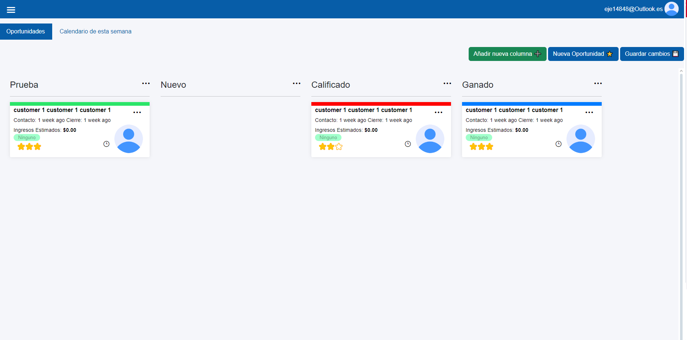
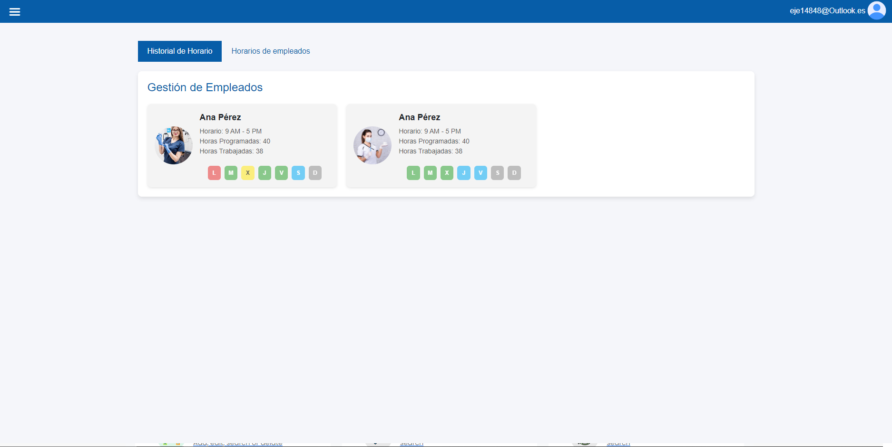

# PLUS ERP - Sistema Mexicano de Gestión para Despachos Jurídicos


**PLUS** es un ERP moderno, minimalista y elegante, inspirado en soluciones como Odoo, pero adaptado a las necesidades reales de los despachos jurídicos en México y América Latina.

PLUS está diseñado para resolver los problemas cotidianos que enfrentan abogados y despachos legales: gestión de clientes, organización de casos, manejo de documentos, facturación, agenda y reportes — todo en una interfaz clara, profesional y de uso sencillo.

---
## 👤 Sobre el autor

**Nombre:** Martínez Ortiz Eduardo Antonio  
**Nacionalidad:** Mexicano 🇲🇽  
**Perfil:** Desarrollador Full Stack apasionado por el software para negocios reales. Tecnología con un toque de magia ❤️

Inicié este proyecto porque queria usar odoo para crear un software ERP para abogados en Mexico, pero cuando intente desarollar mi modulo en odoo obtuve muchos errores, faltas de compatibilidad, no entendia el codigo que escribian otros programadores, cuando sucedia un error tenia que restaurar archivos completos, etc. Pense que con odoo seria muy facil desarollar mi propio ERP pero no. Estuve dias intentando cambiar el nombre del modulo 'proyectos' por el nombre de 'casos' y jamas pude hacerlo jaja entonces me arte y decidi crear mi propio ENGINE ERP, with blackjack and hookers.


El plan era crear un ENGINE super facil, creado para que incluso programadores inexpertos puedan crear sus propias apps para empresas. Ahora en mi ENGINE es super facil cambiar el nombre de las apps ya que solo necesitas un solo clic jaja tambien queria que las dependencias fueran extremadamente facil de agregar y que fuera mas facil de personalizar para otras personas. 

El objetivo de PLUS es ser un **engine abierto** y extensible para que otros programadores, despachos y estudios jurídicos puedan adaptarlo a su realidad, aportar mejoras y evolucionarlo en comunidad.


---

## ✨ Características principales (planes a futuro)
- Gestión de clientes
- Gestión de casos jurídicos
- Plantillas de documentos legales
- Control de facturación y pagos
- Agenda de audiencias y tareas
- Reportes dinámicos
- Soporte multi-usuario y control de permisos
- UI moderna y elegante (inspirada en Odoo y otras apps líderes)

---

## 🚀 Roadmap de funcionalidades (planes a futuro)

- ✅ Agenda avanzada con notificaciones
- ✅ Plantillas de documentos personalizables
- 🚧 Portal para clientes (self-service)
- 🚧 Firma electrónica integrada
- 🚧 Chat interno para abogados
- 🚧 Integración con calendario Google/Outlook

---

## 📦 Instalación técnica

### Requisitos

- Node.js 18+  
- MySQL o PostgreSQL  
- Git

### Instrucciones

```bash
git clone https://github.com/EduardoMartinez68/Lexora
cd plus-erp
npm install

## 👨‍💻 Apartado técnico para desarrolladores

PLUS ERP es un sistema modular, basado en Node.js con Express:

- **Frontend:** HTML + CSS (sin Bootstrap), Handlebars.js para plantillas
- **Backend:** Node.js + Express
- **Base de datos:** MySQL / PostgreSQL (ORM: Sequelize opcional)
- **Arquitectura:** MVC ligera
- **Estilo:** CSS propio con prefijos `sub-menu-app-` para evitar colisiones

